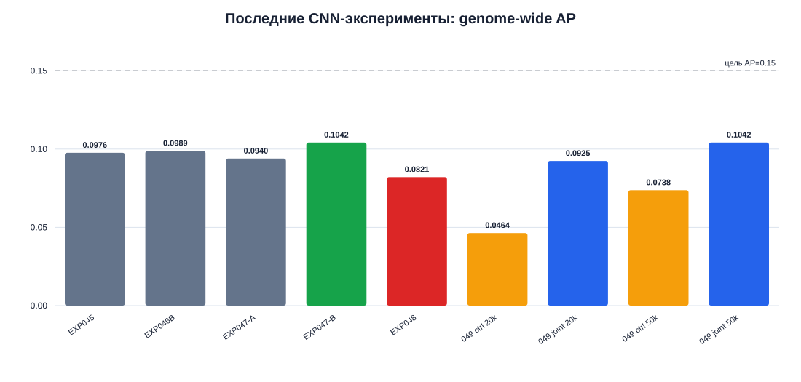

# EPIC — предсказание инициации транскрипции из ДНК

> [!abstract] Назначение
> Открытый исследовательский журнал по предсказанию base-resolution профиля
> инициации транскрипции РНК-полимеразой II из последовательности ДНК.
> Репозиторий объединяет Obsidian vault, воспроизводимые notebooks, код моделей,
> отрицательные результаты и честные сравнения на contig-heldout validation.

## Что посмотреть в первую очередь

| Раздел | Содержание |
|---|---|
| [Итоги CNN-EXP-045—049](docs/CNN_EXP045_049_RESULTS_REVIEW_2026-10-01.md) | главный сравнительный отчёт, таблицы, графики и решения |
| [Реестр CNN](cnn_exp/_index.md) | история архитектурных экспериментов и measured champion |
| [Каталог notebooks](notebooks/README.md) | какие notebooks открывать, что они проверяют и как скачать |
| [Воспроизводимость](docs/REPRODUCIBILITY.md) | окружение, данные, команды и границы публичного репозитория |
| [Validation protocol](docs/03_validation.md) | split по contig, whitelist и определения AP/Spearman |
| [Постановка задачи](docs/00_problem.md) | биологическая и ML-формулировка |
| [Полный Obsidian workflow](GUIDE.md) | устройство vault и правила фиксации экспериментов |

GitHub отображает notebooks прямо в браузере. Для скачивания отдельного
notebook откройте его и нажмите **Download raw file**; для получения всей
истории используйте `git clone` или **Code → Download ZIP**.

## Главные измеренные результаты

| Эксперимент | Архитектура / изменение | Genome-wide AP | EPIC Spearman | Решение |
|---|---|---:|---:|---|
| CNN-EXP-045 | WIDTH512, RF1029, 50k | 0.097630094 | 0.200124323 | reference |
| **CNN-EXP-047-B** | paired risk-focused continuation | **0.104211926** | **0.202291612** | measured AP champion |
| CNN-EXP-048 | ultra-tail risk refinement | 0.082120732 | 0.197690110 | reject |
| CNN-EXP-049 joint | R16 A→FiLM→B, 50k | 0.104208798 | 0.130878357 | reject: champion не превзойдён |

Цель текущей серии — `AP ≥ 0.15`. EXP049 подтвердил пользу регионального
conditioning относительно matched control (`+0.030431 AP` при 50k), но итогом
практически точно воспроизвёл EXP047-B, а не создал новый уровень качества.



> [!warning] Интерпретация результатов
> Validation split многократно использовался для exploratory архитектурных
> решений. Значения полезны для сравнения зафиксированных веток, но не являются
> несмещённой оценкой leaderboard generalization. Label-oracle результаты —
> только диагностика и никогда не используются как признаки или teacher targets.

## Данные и публичные артефакты

Исходные genome/annotation/count данные не хранятся в Git. Репозиторий содержит
описание ожидаемой структуры, preprocessing-код, notebooks и небольшие
сводные графики. Checkpoints, memmap-cache и Kaggle ZIP-бандлы также исключены:
они зависят от локальных данных и превышают разумный размер source repository.

- [Справочник jaNemVect1.1](docs/jaNemVect1.1_file_guide.md)
- [Учебный train/validation/test notebook](notebooks/01_train_validation_test.ipynb)
- [Cloud-инструкция EXP049](docs/CNN_EXP049_CLOUD_TRAINING.md)

## Быстрый локальный запуск

```powershell
git clone https://github.com/tonylarichony-png/EPIC.git
cd EPIC
conda env create -f environment-eda.yml
conda activate epic-eda
$env:PYTHONPATH = "$PWD\src"
python -m pytest -q
```

После размещения исходных файлов согласно справочнику откройте JupyterLab или
сам vault в Obsidian. Точные команды и ограничения приведены в
[документе воспроизводимости](docs/REPRODUCIBILITY.md).

## Карточка проекта

| Поле | Значение |
|---|---|
| Проект | EPIC DNA-to-TSS initiation prediction |
| Цель проекта | Сильный generalizable genome-wide AP на base-resolution target |
| ML-задача | Extremely imbalanced sequence-to-profile ranking |
| Владелец | tonylarichony-png |
| Статус | `active` |
| Текущий этап | `experiments` |
| Обязательные метрики | **Average Precision (AP)** + **EPIC Spearman** (Pearson по dense ranks на `target > 0`) |
| Baseline | [[experiments/EXP-001.md|EXP-001]] — L2 logistic regression по ориентированному динуклеотиду `[-1,0]` |
| Лучший CNN-результат | [[cnn_exp/CNN-EXP-047.md|CNN-EXP-047-B]]: validation AP **0.104211926**, EPIC Spearman **0.202291612** |
| Лучший interpretable feature result | [[experiments/EXP-009.md|EXP-009]]: AP **0.002363735**, EPIC Spearman **0.115517** |
| Репозиторий / код | https://github.com/tonylarichony-png/EPIC |
| Полный последний отчёт | [[docs/CNN_EXP045_049_RESULTS_REVIEW_2026-10-01.md|CNN-EXP-045—049]] |

## Фокус сейчас

> [!todo] Следующее действие
> Одно конкретное действие, которое двигает проект вперёд.

- **Текущая цель:** спроектировать следующий кандидат, способный превзойти measured CNN champion `AP=0.104211926` и приблизиться к `AP=0.15`.
- **Активные гипотезы:** [[hypotheses/H-001.md|H-001]]–[[hypotheses/H-004.md|H-004]].
- **Проведённые эксперименты:** EXP-001 остаётся baseline; EXP-002/003 приняты в lookup-серии; EXP-004/005/006/008 отклонены; [[experiments/EXP-009.md|EXP-009]] принят как feature champion.
- **Банк идей:** [[experiment-ideas/_index.md|ширина контекста, состав, взаимодействия и lowercase]].
- **Главный вывод серии:** CpG O/E201 дал +15.10% AP против EXP-007 и повысил EPIC Spearman до 0.115517.
- **EXP-010:** AP-screening всех 15 пар завершён; GG +4.445%, TA +3.920%, TG +2.860% к mean train-CV AP EXP-009. Полного Spearman нет, validation не подтверждён; champion не изменён.
- **Последняя контрольная точка:** [[docs/CNN_EXP045_049_RESULTS_REVIEW_2026-10-01.md|EXP049 joint 50k]] сравнялся с EXP047-B по AP, но не превзошёл его; простое масштабирование каскада остановлено.
- **Краткие результаты выполненного EDA:** [[docs/02_eda.md#Быстрые выводы|быстрые выводы]] и [[eda/findings/_index.md|карточки EDA-001…EDA-005]].

## Как начать новый эксперимент

> [!tip] Новый контролируемый эксперимент
> 1. Активируйте окружение проекта.
> 2. Из корня проекта запустите `.\new-epic-experiment.cmd`.
> 3. Ответьте на пять вопросов: название, гипотеза, единственное изменение,
>    критерий успеха и место кода (`module` рекомендуется, `notebook` допустим).
>    Команда сама выберет следующий `EXP-xxx` и последний сохранённый
>    `adopt`-champion.
> 4. Откройте созданный `notebooks/experiments/EXP-xxx_*.ipynb` и сначала
>    проверьте зафиксированный план.
> 5. Вместе заполните только новый признак и candidate-код в созданном модуле
>    или ячейке. Общий split загружается из `src/ml_project/epic_data.py`.
> 6. После запуска заполните интерпретацию и решение: `adopt`, `reject`,
>    `iterate` или `inconclusive`.
> 7. Сохраните машинную запись запуска из последней ячейки и перенесите краткий
>    вывод в созданную карточку `experiments/EXP-xxx.md`.
>
> Каждый эксперимент имеет свой читаемый notebook, но подготовка BED/target и
> train/validation/test не копируется. Поэтому результаты используют один data
> contract и остаются сопоставимыми.

Полный процесс, границы ответственности и сравнение с `epic_solution`:
[[docs/epic_experiment_workflow.md]].

## Как начать групповой screening моделей

> [!tip] Выбор семейства после feature engineering
> 1. В `src/ml_project/model_screening_config.py` один раз укажите
>    `feature_reference_module` принятого feature champion.
> 2. Выберите `active_group` и проверьте все стартовые параметры моделей в
>    `MODEL_GROUPS`. Это screening-параметры, а не скрытый tuning.
> 3. Выполните [[notebooks/06_model_screening.ipynb]] сверху вниз. Все модели,
>    включая точный feature champion, получат одинаковые строки, folds и метрики.
> 4. Разберите mean ± std, парные fold wins/losses, OOF-исправления ошибок и
>    importance выбранной диагностической модели.
> 5. Заполните созданную `model-screening/MS-xxx ...md` карточку. Для следующей
>    группы задайте новый `MS-ID`, note и `run_name`, затем повторите notebook.
> 6. После всех групп перенесите 2–3 разных семейства в coarse tuning. Победа
>    стартовой конфигурации сама по себе не регистрирует нового champion.

Старые feature-эксперименты целиком повторять для каждой модели не нужно:
сначала сравниваются семейства на лучшем feature set, затем для shortlist
делаются точечные ablation/retest действительно спорных признаков.

## Как сделать Kaggle submission

> [!tip] Один notebook для любого измеренного кандидата
> 1. Откройте [[notebooks/07_submission.ipynb]] и выполните каталог кандидатов.
> 2. В ячейке выбора задайте новый `SUBMISSION_ID` и один устойчивый
>    `SELECTED_CANDIDATE`, например `MS-001/feature_champion` или
>    `MS-001/random_forest`.
> 3. Проверьте source, feature set, estimator, CV и inference audit до fit.
> 4. Выполните full-train fit, проверьте строки, ключ и распределение prediction.
> 5. Только затем выполните финальную ячейку сохранения и загрузите напечатанный
>    CSV в Kaggle.
> 6. В созданной SUB-карточке вручную запишите Public score и наблюдение.

Notebook не позволяет свободно соединять признаки одного EXP с estimator другого
MS-run: Candidate ID всегда обозначает уже измеренный целый pipeline. EXP со
статусом reject остаются доступными, но контекстно-зависимый raw feature hook
будет остановлен train-serving audit.

## Pipeline

- [ ] 0. [[docs/00_problem.md|Problem — постановка задачи]]
- [ ] 1. [[docs/01_data.md|Data — общая информация об исходных файлах]]
- [ ] 2. [[docs/02_eda.md|EDA — исследование и рекомендации]]
- [ ] 3. [[docs/03_validation.md|Validation — схема оценки]]
- [ ] 4. [[docs/04_features.md|Features — model-ready выборка и признаки]]
- [ ] 5. [[docs/05_experiments.md|Experiments — эксперименты]]
- [ ] 6. [[docs/06_error_analysis.md|Error analysis — анализ ошибок]]
- [ ] 7. [[docs/07_production.md|Production — внедрение и мониторинг]]

> [!important]
> Этап отмечается завершённым только после выполнения его **Stage Gate**. Pipeline цикличен: анализ ошибок и production-мониторинг могут вернуть проект к данным, валидации или признакам.

## Рабочие реестры

- [[hypotheses/_index.md|Гипотезы]]
- [[experiments/_index.md|Эксперименты]]
- [[model-screening/_index.md|Screening моделей]]
- [[submissions/_index.md|Kaggle submissions]]
- [[decisions/_index.md|Решения]]
- [[issues/_index.md|Проблемы и блокеры]]
- [[assets/_index.md|Артефакты и графики]]
- [[artifacts/_index.md|Локальные модели и результаты запусков]]

## Ключевые результаты

<!-- auto:key-results:start -->

| Версия / эксперимент | Метрика | Значение | Δ к baseline | Решение |
|---|---:|---:|---:|---|
| [[experiments/EXP-001.md|EXP-001]] | Average Precision | **0.001330258** | +0.000659614 к constant reference | `adopt` |
| [[experiments/EXP-001.md|EXP-001]] | EPIC Spearman | **0.090720** | +0.090720 к no-ranking reference | `adopt` |
| [[experiments/EXP-002.md|EXP-002]] | Average Precision | **0.001486787** | +11.77% к 2-mer lookup | `adopt` |
| [[experiments/EXP-002.md|EXP-002]] | EPIC Spearman | **0.094232** | +0.003512 к 2-mer lookup | `adopt` |
| [[experiments/EXP-003.md|EXP-003]] | Average Precision | **0.001600537** | +7.65% к 4-mer lookup | `adopt` |
| [[experiments/EXP-003.md|EXP-003]] | EPIC Spearman | **0.097186** | +0.002954 к 4-mer lookup | `adopt` |
| [[experiments/EXP-004.md|EXP-004]] | Average Precision | 0.001603481 | +0.18% к 6-mer lookup | `reject` |
| [[experiments/EXP-004.md|EXP-004]] | EPIC Spearman | 0.092203 | −0.004983 к 6-mer lookup | `reject` |
| [[experiments/EXP-007.md|EXP-007]] | Average Precision | **0.002053635** | +28.31% к EXP-003 | `adopt` |
| [[experiments/EXP-007.md|EXP-007]] | EPIC Spearman | **0.104302** | +0.007117 к EXP-003 | `adopt` |
| [[experiments/EXP-009.md|EXP-009]] | Average Precision | **0.002363735** | +15.10% к EXP-007 | `adopt` |
| [[experiments/EXP-009.md|EXP-009]] | EPIC Spearman | **0.115517** | +0.011215 к EXP-007 | `adopt` |

<!-- auto:key-results:end -->

Блок обновляется автоматически при синхронизации baseline и контролируемых
экспериментов. Подробности результата и выводы хранятся в связанных карточках.

## Последние решения

| Решение | Дата | Причина | Что изменилось |
|---|---|---|---|
| Принять EXP-001 как baseline | 2026-09-16 | AP вырос в 1.9836×, Spearman положителен на всех validation-contig | Появился воспроизводимый reference из 17 категорий динуклеотида |
| Выбрать 6-mer как champion ширины контекста | 2026-09-16 | EXP-003 дал +7.65% AP и улучшил Spearman; EXP-004 добавил лишь +0.18% AP и снизил Spearman | Следующий LR-эксперимент должен исходить из окна `[-5,0]` |

## Риски и блокеры

- [ ]

## Ближайшие действия

- [ ] Дополнить AP-screening EXP-010 недостающим Spearman и сохранить полную таблицу CV; см. [[eda/findings/EDA-005.md|EDA-005]].
- [ ] Применить исходный gate, зафиксировать одного кандидата до validation и сохранить итоговый run.
- [ ] Перед запуском согласовать [[experiment-ideas/IDEA-006_gg_ta_complementarity.md|протокол EXP-011]]: EXP-009, +GG, +TA, +GG+TA; обе метрики сохранять после каждого fit.

## Рабочий принцип

Каждое существенное действие должно отвечать на четыре вопроса:

1. **Почему** это делаем?
2. **Как** проверяем?
3. **Какой результат** получили?
4. **Какое решение** приняли?
