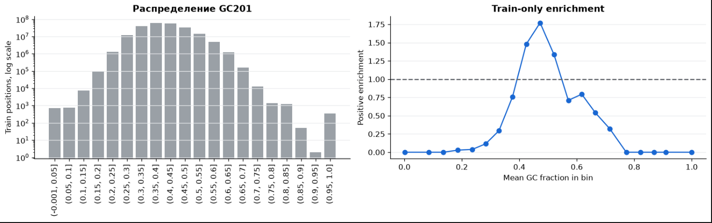

# EDA-002 — GC и состав широкого окна связаны с target

← [[eda/findings/_index.md|EDA-наблюдения]] · [[docs/02_eda.md|02 — EDA]]

> [!abstract] Ключевой вывод
> Средний GC в окне 201 bp равен 0.43334 около положительных и 0.40330 на равномерном train-фоне. Train-only разбиение по GC-bins показывает выраженно нелинейную связь: enrichment положительных достигает примерно 1.5–1.8 при GC около 0.45–0.50 и падает ниже 1 вне среднего диапазона. Это описательная ассоциация; добавочная польза для модели и нужный масштаб не установлены.

## Простыми словами

Для каждой позиции берём 100 нуклеотидов слева, саму позицию и 100 нуклеотидов справа. Получается окно длиной 201 bp. Затем считаем, какая доля известных букв в нём приходится на `G` или `C`.

- Около позиции с csRNA-сигналом среднее окно содержит примерно **43.3% GC**.
- У случайной позиции train — примерно **40.3% GC**.
- Разница равна **3 процентным пунктам**. Для окна без `N` это приблизительно **87 букв G/C вместо 81**, то есть в среднем около шести дополнительных G/C на 201 bp.

Это означает, что положительные позиции чаще находятся в немного более GC-богатом окружении. Это групповой статистический сдвиг: по одному конкретному окну с GC=43% нельзя уверенно определить наличие сигнала, а высокая GC сама по себе не является достаточным правилом классификации.

## Исследовательский вопрос

Добавляет ли агрегированный состав ДНК информацию к короткому позиционному окну?

## Метод

GC рассчитан среди A/C/G/T в обрезанном по реальному контигу окне 201 bp. Положительные сравнивались с равномерной выборкой 200 000 train position-strand; в фоне случайно присутствуют 163 положительные позиции.

Для дополнительной train-only диагностики все разрешённые train-позиции были разбиты на GC-bins шириной 0.05. Для каждого bin рассчитано отношение частоты положительного target внутри bin к средней частоте положительного target по train:

```text
enrichment(bin) = P(target=1 | GC201 входит в bin) / P(target=1)
```

Значение `1` означает среднюю частоту train, значение выше `1` — обогащение положительными позициями, ниже `1` — обеднение.

## Наблюдение и надёжность

Разность средних около 3.0 процентного пункта заметна на большой выборке, но распределения положительных и отрицательных окон сильно перекрываются. Одно среднее не показывает, монотонна ли связь, одинакова ли она на каждом контиге и остаётся ли она после учёта букв в коротком позиционном окне. GC соседних масштабов также сильно коррелирует.

### Форма связи GC201 с target



Для интерпретации важнее правый график:

- при среднем GC около **0.45–0.50** enrichment достигает примерно **1.5–1.8**: положительные позиции встречаются здесь в 1.5–1.8 раза чаще среднего по train;
- при GC ниже примерно **0.35** и выше примерно **0.60–0.65** enrichment заметно ниже `1`;
- следовательно, GC201 действительно содержит предиктивный сигнал, но зависимость имеет максимум в среднем диапазоне и не сводится к правилу «чем больше GC, тем лучше»;
- крайние GC-bins содержат мало позиций, что видно на левом логарифмическом графике. Их значения enrichment менее устойчивы и должны сопровождаться знаменателями или доверительными интервалами.

> [!important] Практический вывод
> Один линейный коэффициент при GC201 может описать эту форму лишь частично. Зафиксированный EXP-006 всё равно следует сравнить с baseline без изменения протокола, а нелинейное кодирование GC — bins, spline или заранее заданный квадратичный член — проверить отдельной абляцией на тех же grouped folds.

### Почему первым агрегатом выбран именно GC

GC201 — не утверждение, что только сочетание `G+C` важно. Это простой и заранее мотивированный baseline:

1. **Предварительный EDA уже показал сдвиг:** 43.33% GC около положительных против 40.33% на train-фоне.
2. **Признак компактен:** одно число описывает широкий 201-bp контекст и дёшево считается для сотен миллионов position-strand.
3. **Он инвариантен к reverse complement:** доля `G+C` не меняется при переходе между цепями, поэтому определение одинаково для `+` и `−`.
4. **Есть биологическая интерпретация:** GC связан со стабильностью и расплетанием дуплекса, формой ДНК, склонностью к нуклеосомной упаковке и GC/CpG-богатыми классами промоторного окружения. Это не доказывает причинность.
5. **Он дополняет локальные k-mer:** `2/4/6-mer` описывают конкретный мотив непосредственно около позиции, тогда как GC201 суммирует более широкий региональный фон.

### Почему нельзя ограничиваться GC

- `AT fraction` при окне только из A/C/G/T почти равен `1 − GC` и потому отдельно почти полностью избыточен.
- Отдельные доли `A`, `C`, `G`, `T` могут содержать дополнительный сигнал; после ограничения суммы до 1 у них остаются три независимые степени свободы.
- `GC skew = (G−C)/(G+C)` и `AT skew = (A−T)/(A+T)` могут улавливать направленную асимметрию, которую сумма `G+C` стирает.
- Частота `CpG` и CpG observed/expected отделяют специфический динуклеотидный сигнал от общего GC.
- Динуклеотидные частоты, энтропия/низкая сложность, доля lowercase, `N`, край contig и GC на нескольких масштабах могут описывать другие свойства последовательности.
- Физически мотивированные агрегаты — predicted melting energy, bendability и nucleosome affinity — логично проверять позже, если простые признаки дают устойчивый прирост.

Сравнивать эти варианты нужно не по красоте train-графика, а последовательными абляциями на одинаковых удерживаемых contig: локальный baseline → `+GC201` → `+нелинейный GC` → `+другие composition-признаки`. Так будет видно, какой сигнал действительно добавочен к уже использованным k-mer.

### Что из результата следует

- GC — обоснованный кандидат в признаки логистической регрессии.
- Связь GC201 с target нелинейна; одной разности средних недостаточно.
- Его нужно проверять как добавку к позиционным буквам, потому что короткое one-hot окно уже частично кодирует локальный GC.
- Полезный масштаб заранее неизвестен: 101 bp может описывать близкий мотив, а 401–801 bp — более широкий тип участка.

### Что из результата не следует

- Нельзя утверждать, что GC вызывает начало транскрипции.
- Нельзя использовать порог вроде `GC > 43%` как готовый классификатор.
- Нельзя считать окно 201 bp оптимальным: оно было единственным масштабом прежнего описательного анализа.
- Нельзя считать различие новым независимым результатом на test: анализ выполнен на train и используется для выбора признаков.

### Решение для модели

В IDEA-002 предложено зафиксировать позиционные признаки `pos51` и по одному
добавлять агрегаты состава для окон 101, 201, 401 и 801 bp. Это пока подсказка,
а не выполненное сравнение. Решение потребуется принимать по Average Precision
и EPIC Spearman в будущем `EXP`.

## Возможная гипотеза

[[hypotheses/H-002.md|H-002]]: при фиксированном pos51 отдельно сравнить composition-окна 101/201/401/801 bp.

## Связанные эксперименты

<!-- auto:eda-experiment-links:start -->

| Эксперимент                                                                              | Гипотеза | Решение | Метрика                            | Δ   |
| ---------------------------------------------------------------------------------------- | -------- | ------- | ---------------------------------- | --- |
| [[experiment-ideas/IDEA-002_sequence_composition.md\|IDEA-002 — состав последовательности на разных масштабах]] | H-002 | idea | обе метрики ещё не вычислялись | — |

<!-- auto:eda-experiment-links:end -->

## Источник

- `artifacts/eda/nematostella/summary.json`, раздел `windows`
- `assets/eda/nematostella/contigs_gc.png`
- train-only diagnostic из `notebooks/experiments/EXP-006_gc201_logistic.ipynb`
- `assets/eda/nematostella/gc201_train_enrichment.png`
