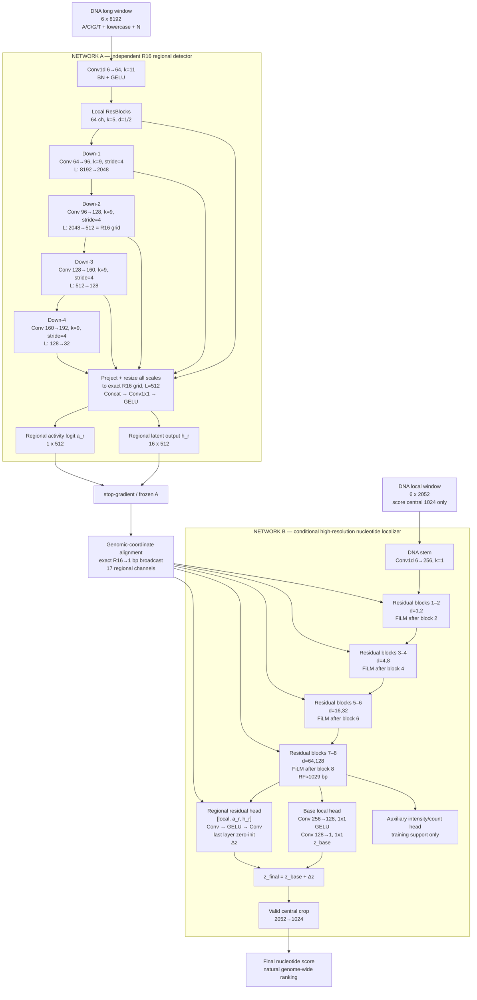
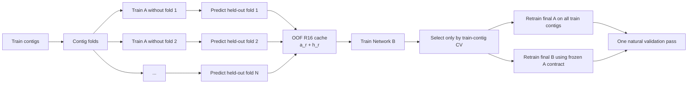
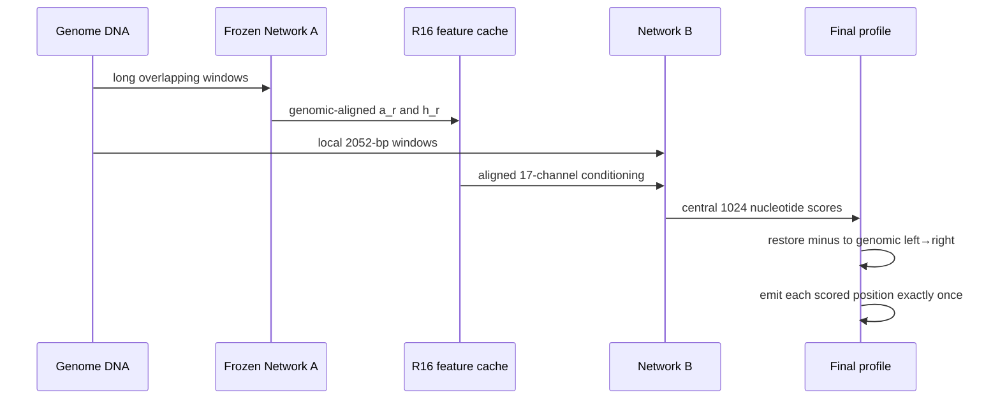

# CNN-EXP-049 — R16 coarse-to-fine cascade

> **Статус:** архитектурный проект, а не завершённая pre-registration и не результат эксперимента.
> Численные коэффициенты loss и training budget должны быть зафиксированы отдельной pre-registration до первого запуска.

## 1. Зачем меняем факторизацию задачи

Текущая CNN одновременно пытается решить две разные задачи:

1. определить, есть ли транскрипционная активность в окружающем регионе;
2. найти точный nucleotide начала транскрипции внутри активного региона.

EXP048 показал конфликт: модель может опустить один класс FP, но при этом поднимает другие части широкого отрицательного хвоста. Простое увеличение ширины этот конфликт не устранило.

R16 label-oracle показал высокий доступный потолок:

| Модель/диагностика | Natural AP |
|---|---:|
| EXP045 baseline, использованный oracle-анализом | 0.097630 |
| R16 label oracle | **0.289735** |
| Прирост oracle | **+0.192105** |

Oracle сохранял `positive recall = 1.0` и только подавлял позиции в истинно пустых strand-specific R16-регионах. Это не результат обучаемой модели, но свидетельство того, что правильное разделение regional и local задач имеет достаточный потолок для цели `AP >= 0.20`.

EXP046B не реализовал этот замысел полностью: он обучал маленькую голову поверх замороженных признаков существующего backbone и дал только `+0.001237 AP`. Новый эксперимент должен использовать **две независимые последовательные сети**.

## 2. Главная гипотеза

Сначала отдельная сеть A с длинным контекстом оценивает активность каждого strand-specific 16-bp региона. Затем отдельная сеть B использует исходную ДНК и замороженные OOF-признаки A, чтобы локализовать TSS с разрешением 1 bp.

Факторизация задачи:

\[
P(y_i>0\mid X)
\approx
P(A_{r(i)}=1\mid X_{long})
\cdot
P(y_i>0\mid A_{r(i)},X_{local}),
\]

где `r(i)` — strand-specific R16-бин, содержащий nucleotide `i`.

В первой реализации произведение не применяется как жёсткая формула финального score: сеть B получает regional evidence как conditioning и может восстановить positive при неуверенности A.

## 3. Полная схема



Короткая текстовая версия:

```text
RAW DNA, long context
        │
        ▼
┌─────────────────────────────────────────────────────────┐
│ Network A: long-context multiscale R16 detector         │
│                                                         │
│ DNA → local stem → stride-4 tower → multiscale fusion   │
│                                  ├─ activity logit a_r  │
│                                  └─ latent vector h_r   │
└─────────────────────────────────────────────────────────┘
        │ frozen, OOF on training contigs
        ▼
exact genomic R16 → 1-bp alignment
        │
        ├────────────────────────────────────────────┐
        │                                            │
RAW DNA, local context                               │
        │                                            │
        ▼                                            ▼
┌─────────────────────────────────────────────────────────┐
│ Network B: full-resolution nucleotide localizer         │
│                                                         │
│ DNA stem → residual blocks → local representation       │
│                 ▲        ▲        ▲        ▲             │
│                 └── FiLM conditioning from (a_r, h_r)   │
│                                                         │
│ base local logit z_base + regional correction Δz        │
└─────────────────────────────────────────────────────────┘
        │
        ▼
final 1-bp score on central valid crop
```

## 4. Контракт входов и координат

### 4.1 DNA encoding

Вход обеих сетей:

| Каналы | Значение |
|---:|---|
| 0–3 | one-hot A/C/G/T |
| 4 | lowercase / soft-mask flag |
| 5 | N / unknown flag |

Lowercase и uppercase сохраняют одинаковый nucleotide identity, но различаются каналом soft-mask.

### 4.2 R16 key

Регион определяется только так:

```text
(contig, strand, floor(genomic_position / 16))
```

Региональная сетка привязана к абсолютной genomic coordinate, а не к началу случайного обучающего окна.

### 4.3 Minus strand

Обе сети используют один набор весов для двух цепей:

1. plus: обычная последовательность;
2. minus: reverse complement;
3. выход minus переворачивается обратно в genomic left→right;
4. только после этого regional features соединяются с абсолютными R16-координатами.

Это обязательный invariant. Нарушение порядка способно искусственно улучшить или ухудшить результат.

## 5. Network A — слои

Основной вход A: `[B, 6, 8192]`. Для окна длиной 8192 получается 512 R16-бинов.

| Этап | Операция | Выход |
|---|---|---|
| Input | six-channel DNA | `[B, 6, 8192]` |
| Stem | `Conv1d(6,64,k=11,p=5)` → BN → GELU | `[B,64,8192]` |
| Local | два residual-блока, `k=5`, dilation `1,2` | `[B,64,8192]` |
| Down-1 | `Conv1d(64,96,k=9,s=4,p=4)` → BN → GELU + residual blocks | `[B,96,2048]` |
| Down-2 | `Conv1d(96,128,k=9,s=4,p=4)` → BN → GELU + residual blocks | `[B,128,512]` |
| Down-3 | `Conv1d(128,160,k=9,s=4,p=4)` → BN → GELU + residual blocks | `[B,160,128]` |
| Down-4 | `Conv1d(160,192,k=9,s=4,p=4)` → BN → GELU + residual blocks | `[B,192,32]` |
| Fusion | projection of every scale + resize to length 512 + concat | `[B,C_fused,512]` |
| Bottleneck | `Conv1d(C_fused,64,1)` → GELU | `[B,64,512]` |
| Latent | `Conv1d(64,16,1)` | `[B,16,512]` |
| Activity | `Conv1d(64,1,1)` | `[B,1,512]` |

Выход `h_r` нужен B не вместо activity logit, а вместе с ним: logit сообщает уверенность активности, latent features — какой regional pattern увидела A.

## 6. Network B — слои

### 6.1 Размер окна

```text
target length:       1024 bp
true context flank:   514 bp слева + 514 bp справа
input length:        2052 bp
```

B выдаёт predictions только для центральных 1024 позиций. Padding внутри backbone не заменяет реальную ДНК за границей target.

### 6.2 Основной local trunk

| Блок | Kernel | Dilation | Каналы | Conditioning после блока |
|---:|---:|---:|---:|---|
| Stem | 1 | 1 | `6→256` | нет |
| Residual 1 | 7 | 1 | `256→256` | нет |
| Residual 2 | 3 | 2 | `256→256` | FiLM-2 |
| Residual 3 | 3 | 4 | `256→256` | нет |
| Residual 4 | 3 | 8 | `256→256` | FiLM-4 |
| Residual 5 | 3 | 16 | `256→256` | нет |
| Residual 6 | 3 | 32 | `256→256` | FiLM-6 |
| Residual 7 | 3 | 64 | `256→256` | нет |
| Residual 8 | 3 | 128 | `256→256` | FiLM-8 |

Каждый residual-блок содержит две convolution. Совокупный theoretical receptive field — около 1029 bp.

### 6.3 FiLM adapter

Для каждой base position собирается conditioning tensor:

```text
c_i = concat(activity_logit_r, latent_r)
shape = [B, 17, 2052]
```

Каждый FiLM adapter:

```text
Conv1d(17, 64, 1)
GELU
Conv1d(64, 512, 1)  # 256 gamma + 256 beta
split → gamma, beta
```

Модификация local activation:

\[
x' = x\odot\left(1+0.1\tanh\gamma\right)
     +0.1\tanh\beta.
\]

Последняя convolution каждого adapter инициализируется нулями. В начале обучения conditioning является тождественным преобразованием и не разрушает local path.

### 6.4 Выходные слои

Base local head:

```text
Conv1d(256, 128, 1)
GELU
Conv1d(128, 1, 1)
→ z_base
```

Regional residual head:

```text
concat(local_features[256], regional_features[17])
Conv1d(273, 128, 1)
GELU
Conv1d(128, 1, 1), zero-init
→ delta_z
```

Финальный nucleotide logit:

\[
z_{final}=z_{base}+\Delta z.
\]

Вспомогательная intensity/count head:

```text
Conv1d(256, 128, 1)
GELU
Conv1d(128, 1, 1)
```

Она поддерживает количественный сигнал, но primary AP считается по одному заранее зафиксированному final score.

## 7. Почему B имеет ширину 256, а не 512

Это не утверждение, что WIDTH256 в старой постановке лучше WIDTH512. Причина функциональная:

- A уже берёт на себя длинный контекст и regional discrimination;
- B должна специализироваться на 1-bp localization;
- корректный вход B становится длиннее: 2052 вместо 1284;
- WIDTH256 на полном контексте имеет более безопасный activation footprint;
- WIDTH512 почти исчерпал доступные время и ресурсы компьютера;
- освободившийся бюджет расходуется на независимую A и корректные OOF features.

Если B256 не удерживает local качество даже с oracle/OOF conditioning, widening B не является автоматическим следующим шагом: сначала проверяется loss, alignment и фактическое использование A.

## 8. Loss сети B

Основной loss EXP047-B сохраняется как проверенная сильная часть. К нему добавляется задача локализации внутри активного R16.

\[
L_B =
L_{EXP047B}
+\lambda_{within}L_{within\mbox{-}R16}
+\lambda_{count}L_{count}
+\lambda_{res}L_{residual\ regularization}.
\]

Pairwise вариант внутри активного бина:

\[
L_{within\mbox{-}R16}
=
\operatorname{softplus}(z_{negative}-z_{positive}).
\]

Правила:

- positives сравниваются с отрицательными nucleotide **в том же strand-specific R16**;
- при нескольких positives в одном бине все они остаются positives;
- 16-way single-class softmax запрещён, поскольку в R16 может быть больше одного positive;
- широкие natural negatives сохраняются через основной EXP047-B loss;
- коэффициенты фиксируются по train-contig CV, не по validation.

## 9. Почему не используется hard gate

В первой версии запрещено:

```python
if p_region < threshold:
    nucleotide_score = 0
```

Ошибка A тогда необратимо удаляет настоящий positive. Вместо этого региональный сигнал входит мягко через FiLM и residual correction. Local DNA path остаётся доступным и способен переопределить неуверенный regional signal.

Hard gate допустим только отдельным поздним ablation после доказанного recall A около `0.995–0.999` на train-contig OOF.

## 10. OOF-обучение без leakage

Сеть B не должна видеть in-sample predictions A на train-контингах.



Запрещено:

- обучать B на predictions A, полученных тем же A на его собственных train examples;
- выбирать FiLM placement, loss weights или threshold по validation;
- использовать validation labels для hard-negative mining;
- подавать label-oracle mask в B, кроме отдельно маркированного diagnostic upper-bound теста.

## 11. Inference



Сеть A можно прогнать один раз и сохранить компактный cache. При обучении B и повторной настройке B повторный DML inference A не требуется.

## 12. Обязательные sanity checks

До длинного обучения:

1. нулевые FiLM/adapters не меняют выход B относительно того же B без conditioning;
2. сдвиг genomic window не меняет R16 key одной и той же позиции;
3. plus/minus round-trip возвращает features в правильную genomic coordinate;
4. target crop содержит ровно 1024 позиции;
5. каждый target nucleotide имеет полный реальный RF, кроме отдельно маскируемых краёв contig;
6. B не получает label-derived oracle features;
7. OOF cache покрывает каждый train example ровно один раз;
8. AP считается глобально на natural distribution, а не как среднее batch AP.

## 13. Этапы и stop/go критерии

### Stage A — regional detector

На train-contig OOF измеряются:

- active-region recall;
- LOW_TP-region retention;
- coverage опасных HFP, находящихся в истинно пустых R16;
- natural nucleotide AP после простого диагностического применения regional score к зафиксированному baseline.

Если A не может удерживать active recall около `0.995` и одновременно существенно ранжировать опасные empty regions ниже активных, B не запускается на полном бюджете.

### Stage B — conditional localizer

До natural validation каскад должен показать на полностью OOF train-contig evaluation:

```text
minimum continuation target: AP >= 0.15
```

Это не acceptance по validation, а защита от ещё одного 12-часового запуска ради тысячной доли.

### Final validation

Reference: EXP047-B, `AP ≈ 0.10421`.

| Результат | Решение |
|---|---|
| `< 0.13` | направление не подтверждено; STOP |
| `0.13–0.155` | полезный сигнал есть, но требуемого скачка нет |
| `>= 0.156` | минимум +50% относительно EXP047-B; кандидат ADOPT |
| `>= 0.20` | основная целевая зона |

Дополнительно обязательны отсутствие катастрофического падения хотя бы на одном validation contig и отчёт по EPIC Spearman.

## 14. Что является главным изменением

Эксперимент не проверяет «ещё одну голову» и не проверяет «ещё один вес HARD_FP».

Проверяется следующая система:

```text
independent long-context regional model
                  ↓
frozen out-of-fold regional evidence
                  ↓
independent high-resolution conditional localizer
```

Основной научный вопрос:

> Может ли независимая R16-сеть приблизить обучаемый каскад к большому потолку label-oracle, если вторая сеть получает regional evidence как мягкое условие и отдельно оптимизирует точную 1-bp локализацию?

## 15. Что ещё не зафиксировано

До реализации нужно отдельно pre-register:

- число contig folds для OOF A;
- sampling A и долю dangerous empty regions;
- точные `lambda_within`, `lambda_count`, `lambda_res`;
- training steps и checkpoint cadence для A и B;
- optimizer и LR schedule;
- способ выбора единственного submission score для совместной оценки AP и EPIC Spearman;
- полный перечень сохраняемых artifacts и recovery checkpoints.

Эти параметры нельзя выбирать после просмотра natural validation.
